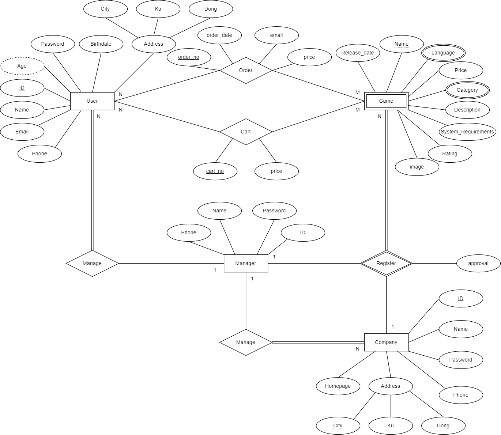
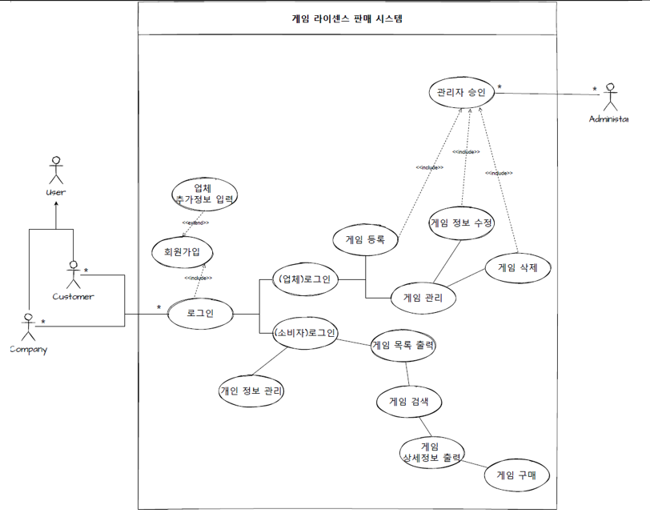

# DatabaseSystem Final Projsct (CBNU)
## 프로젝트 소개
2021년도 2학기 데이터베이스시스템 기말 프로젝트

소프트웨어공학 시간에 작성한 문서 기반으로 개발한 게임 SW 판매 웹 사이트

## 팀 구성 및 역할 분담
- **차재현**
  - 회원가입
  - 로그인(매니저,업체, 개인 유저 구분)
  - 마이페이지(유저 개인정보, 유저 구매내역)

- **노관태**
  - 메인화면
  - 상품 리스트화면
  - 상품 상세정보화면
  - 장바구니 화면

- **김강민**
  - 게임 등록화면(업체입장)
  - 게임 관리화면(리스트만 보여주는 느낌)(업체입장)
  - 게임 승인화면(관리자 입장)
  - 유저(개인/업체) 관리화면(관리자입장)

## 기술스택
- HTML
- CSS
- JS
- Node js
- My SQL

## 설계 문서
### ER Diagram

### Usecase Diagram

## Description 
1. /DB : index.js에서 DB connection 설정 가능. 각자 비밀번호 입력하고 connection 오류 발생시 주석 참고
2. /router : 각 페이지 루트 관리
3. /views : HTML 템플릿 가져온거 적용해둔곳. public 폴더 만들어서 스타일링 관리하려고 했는데 스타일링이 다 절대경로라 CSS도 같이 들어가있음
4. server.js : 포트번호 3000번 이미 사용중이면 바꿔서 쓸 것.

프로젝트 Pull 받아서 실행할 때 npm install 해줄 것.
